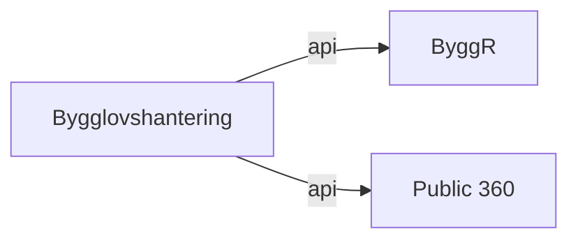

# Systemregister — Sundsvalls kommunkoncern

IT-systemregister med stöd för NIS2/CSL, ISO 27001, MSB/MCF och GDPR.  
Multi-org-stöd för DigIT (13+ politiskt styrda organisationer).

## Produktion — engångs-setup av databasen

Innan första deployen mot en ny Postgres-instans måste extensions och
superadmin-rollen sättas upp manuellt. Se [`docs/DATABASE_SETUP.md`](docs/DATABASE_SETUP.md).

## Snabbstart (lokal utveckling)

```bash
# Starta PostgreSQL + backend
docker compose up -d

# Kör migrationer
docker compose exec backend alembic upgrade head

# Seed med exempeldata
docker compose exec backend python -m scripts.seed

# API-dokumentation
open http://localhost:8000/docs
```

## Projektstruktur

```
systemregister/
├── CLAUDE.md              # Projektguide för Claude Code
├── docker-compose.yml     # Lokal dev-miljö
├── Dockerfile             # Produktion (multi-stage)
├── backend/
│   ├── app/
│   │   ├── api/           # FastAPI-endpoints
│   │   ├── core/          # Config, databas
│   │   ├── models/        # SQLAlchemy-modeller + enums
│   │   ├── schemas/       # Pydantic request/response
│   │   ├── services/      # Business logic
│   │   └── main.py        # FastAPI app
│   ├── alembic/           # Databasmigrationer
│   └── pyproject.toml
├── frontend/              # React + TypeScript (TBD fas 3)
├── k8s/
│   ├── base/              # Kustomize base manifests
│   └── overlays/dev/      # Dev-overlay
└── scripts/
    ├── init-db.sql        # PostgreSQL extensions
    └── seed.py            # Exempeldata
```

## Tech stack

- **Backend:** Python 3.12 · FastAPI · SQLAlchemy 2.0 (async) · Alembic · PostgreSQL 16
- **Frontend:** React 19 · TypeScript · Vite 8 · Tailwind CSS 4 · shadcn/ui · TanStack Query v5 · React Router v7
- **Deploy:** Dokploy (Docker-based PaaS) · GitHub Actions for CI

## Regulatoriska drivkrafter

- Cybersäkerhetslagen (SFS 2025:1506) / NIS2
- MSBFS 2020:6 & 2020:7 (MCF)
- ISO/IEC 27001:2022 (Annex A.5.9, A.5.12 m.fl.)
- GDPR artikel 30 (behandlingsregister)

## Verksamhetsskikt och rollkatalog (2026-04-29)

Utöver system-, integrations- och informationsmängds-modellerna finns nu:

- **Verksamhetsförmågor** (`/api/v1/capabilities`) — hierarkiska, kopplas till
  system och processer.
- **Verksamhetsprocesser** (`/api/v1/processes`) — hierarkiska, kopplas till
  system, förmågor och informationsmängder.
- **Värdeströmmar** (`/api/v1/value-streams`) — namngivna med ordnade etapper.
- **Organisationsenheter** (`/api/v1/org-units`) — hierarkisk trädstruktur per
  organisation.
- **Verksamhetsroller**, **befattningar**, **roll-åtkomst** och
  **anställningsmallar** (`/api/v1/business-roles`, `/positions`,
  `/role-access`, `/employment-templates`) — med `resolved-access`-endpoint
  som ger IT-samordnaren det åtkomstpaket som följer av en mall.

### Diagram + export

- `GET /api/v1/diagrams/capability-map.mmd?organization_id=...`
- `GET /api/v1/diagrams/system-landscape.mmd?organization_id=...`
- `GET /api/v1/diagrams/process-flow/{id}.mmd`
- `GET /api/v1/diagrams/value-stream/{id}.mmd`
- `GET /api/v1/diagrams/context/{system_id}.mmd`
- `GET /api/v1/export/archimate.xml?organization_id=...` — ArchiMate Open
  Exchange (importeras av Archi, Sparx EA, 2C8 via plugin).
- `GET /api/v1/export/2c8/full-package.zip?organization_id=...` — paket för
  manuell import i 2C8 Modeling Tool (objekt + relationer + README).

Exempel — Mermaid renderas direkt från endpointens utdata:



### Sundsvall-seed

```bash
docker compose exec backend python -m scripts.seed_sundsvall
```

Idempotent. Lägger upp organisationer, förvaltningar/avdelningar, ~26
förmågor, ~14 processer, 3 värdeströmmar, 18 system, 15 integrationer, 8
informationsmängder, 11 roller, 5 befattningar och 5 anställningsmallar.
