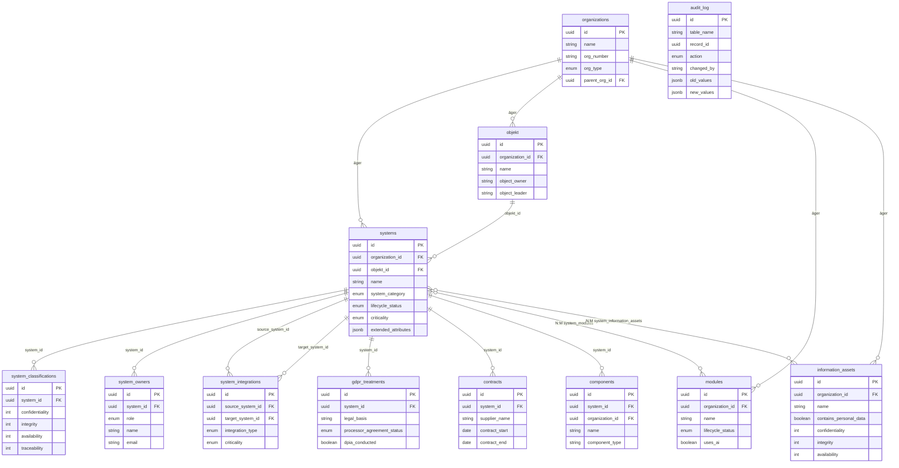

# Arkitektur — Systemregister

## Tech stack

| Lager | Teknik |
|-------|--------|
| Frontend | React 19, TypeScript, Vite 8, Tailwind CSS 4, shadcn/ui, TanStack Query v5, React Router v7 |
| Backend | Python 3.12, FastAPI, SQLAlchemy 2.0 (async), Alembic |
| Databas | PostgreSQL 16 (RLS, JSONB) |
| Deploy | Dokploy (Docker-based PaaS) |
| CI | GitHub Actions (lint, test, security scan, build) |

## Request flow

```
Browser
  |
  v
Dokploy Reverse Proxy (HTTPS)
  |
  +---> Nginx (frontend, statiska filer)
  |       |
  |       +---> /api/* proxy_pass -->+
  |                                  |
  +----------------------------------+
  |
  v
Uvicorn (FastAPI)
  |
  +---> SecurityHeadersMiddleware
  +---> CORS Middleware
  +---> Rate Limiting
  |
  v
API Router (/api/v1/*)
  |
  +---> Pydantic validation (request)
  +---> get_rls_db (org-context)
  |
  v
SQLAlchemy ORM
  |
  +---> RLS filter (organization_id)
  +---> Audit event listener
  |
  v
PostgreSQL 16
```

## Datamodell



## Deployment-topologi

```
GitHub (Hovhas/systemregister)
  |
  | push to master
  v
Dokploy Webhook
  |
  v
Docker Build (multi-stage)
  |
  +---> Stage 1: Backend (uv + Python deps)
  +---> Stage 2: Frontend (npm + Vite build)
  +---> Stage 3: Production (Nginx + Uvicorn)
  |
  v
Dokploy Container
  |
  +---> Nginx (:80) - statiska filer + API proxy
  +---> Uvicorn (:8000) - FastAPI backend
  +---> PostgreSQL (Dokploy-managed)
```

## Entitetshierarki

```
Organisation
  |
  +---> Objekt (verksamhetsområde)
  |       |
  |       +---> System (IT-system)
  |               |
  |               +---> Komponent (delsystem)
  |               +---> Modul (N:M, delad mellan system)
  |               +---> Informationsmängd (N:M, delad mellan system)
  |               +---> Klassning (K/R/T historik)
  |               +---> Ägare/roller
  |               +---> Integrationer
  |               +---> GDPR-behandlingar
  |               +---> Avtal
  |
  +---> Modul (organisation-scope)
  +---> Informationsmängd (organisation-scope)
```
